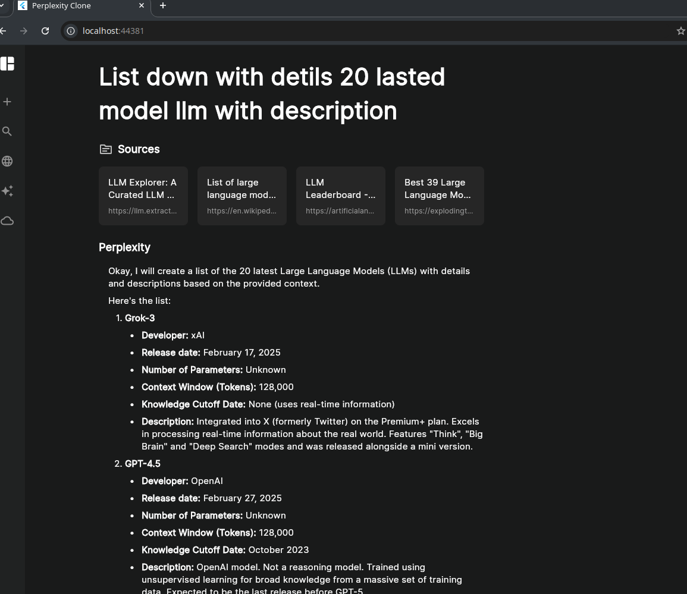

# Perplexity Clone: AI-Powered Search and Chat Application

This project is a clone of the Perplexity AI website, designed to provide an AI-powered search and chat experience. It's built using Flutter for the frontend and Python (FastAPI) for the backend, leveraging powerful tools like Tavily for web search and Gemini for generating intelligent responses.

## Project Overview

This application mimics the core functionality of Perplexity AI, allowing users to ask questions and receive detailed, well-cited answers sourced from the web. The system integrates web search, content sorting, and large language model (LLM) capabilities to deliver a seamless and informative user experience.

**Key Features:**

- **AI-Powered Search:** Uses Tavily to perform comprehensive web searches based on user queries
- **Intelligent Response Generation:** Employs Google's Gemini LLM to generate detailed, context-aware responses
- **Real-Time Chat:** Utilizes WebSockets for a dynamic, real-time chat experience
- **Source Citation:** Provides clear citations to the sources used in generating the response
- **Responsive Design:** Flutter frontend designed to work across different screen sizes (especially web)
- **Skeleton Loading:** Visual feedback during data fetching operations
- **Clean UI:** User-friendly and intuitive interface

## Project Structure

The project is divided into two main parts: the frontend (Flutter) and the backend (Python/FastAPI).

### Frontend (Flutter)

The Flutter application handles the user interface, user interactions, and communication with the backend server.

**Key Components:**

- **User Interface:** Clean and intuitive interface for query input and result viewing
- **Real-Time Updates:** WebSocket integration for live updates of search results and generated responses
- **Data Display:** Structured presentation of search results and AI responses
- **State Management:** Handles application state including loading indicators and data updates
- **WebSocket Service:** Manages WebSocket connection and communication
- **Skeleton Loading:** Provides visual feedback during data loading

**Directory Structure:**

```
lib/
├── main.dart                 # Entry point of the Flutter application
├── pages/                    # Application pages
│   ├── chat_page.dart        # Chat results display page
│   └── home_page.dart        # Main search page
├── services/                 # Backend interaction services
│   └── chat_web_service.dart # WebSocket communication logic
├── theme/                    # App theming
│   └── colors.dart           # Color definitions
└── widgets/                  # Reusable UI components
    ├── answer_section.dart   # AI-generated answer display
    ├── search_section.dart   # Search input and button
    ├── side_bar.dart         # Sidebar navigation (for web)
    └── source_section.dart   # Sources display
```

**Packages Used:**

- **`flutter_lints`:** Code linting and quality
- **`google_fonts`:** Google Fonts integration
- **`web_socket_client`:** WebSocket communication
- **`flutter_markdown`:** Markdown content rendering
- **`skeletonizer`:** Skeleton loading animations

**Screenshot**



### Backend (Python/FastAPI)

The Python backend handles the core logic including web searching, content sorting, and response generation.

**Key Components:**

- **API Endpoints:** REST and WebSocket endpoints for frontend communication
- **Web Search:** Tavily integration for powerful web searches
- **Content Sorting:** Relevance-based sorting of search results
- **LLM Integration:** Google's Gemini LLM for intelligent response generation
- **Real-Time Communication:** WebSocket streaming for immediate response delivery

**Directory Structure:**

```
server/
├── main.py                   # Main FastAPI application
├── services/                 # Backend services
│   ├── llm_service.py        # LLM response generation
│   ├── search_service.py     # Tavily web search integration
│   └── sort_source_service.py # Search results sorting
├── pydantic_models/          # Data validation models
│   └── chat_body.py          # Chat request model
├── .env                      # Environment variables
└── requirements.txt          # Python dependencies
```

**Frameworks and Libraries:**

- **`FastAPI`:** API endpoint creation
- **`pydantic`:** Data validation and settings management
- **`python-dotenv`:** Environment variable management
- **`google-generativeai`:** Gemini LLM integration
- **`tavily-python`:** Tavily search API integration

**API Endpoints:**

- **`/ws/chat` (WebSocket):** Real-time chat communication
  - Receives user queries
  - Performs web searches
  - Sorts search results
  - Streams AI-generated responses to the client
- **`/chat` (POST):** REST endpoint for chat functionality
  - Processes queries via HTTP requests
  - Returns complete responses with search results and AI-generated content

**Environment Variables:**

Required variables in `.env` file:

- **`TAVILY_API_KEY`:** Tavily search service API key
- **`GEMINI_API_KEY`:** Google Gemini LLM service API key

## Setup Instructions

### Backend Setup (Python)

1. **Clone the repository:**

   ```bash
   git clone <repository_url>
   cd perplexity_clone
   ```

2. **Navigate to the server directory:**

   ```bash
   cd server
   ```

3. **Create a virtual environment:**

   ```bash
   python3 -m venv .venv
   source .venv/bin/activate  # On Linux/macOS
   .venv\Scripts\activate     # On Windows
   ```

4. **Install the dependencies:**

   ```bash
   pip install -r requirements.txt
   ```

5. **Create a `.env` file with your API keys:**

   ```
   TAVILY_API_KEY=<your_tavily_api_key>
   GEMINI_API_KEY=<your_gemini_api_key>
   ```

6. **Run the server:**
   ```bash
   fastapi dev main.py
   ```

### Frontend Setup (Flutter)

1. **Navigate to the project root:**

   ```bash
   cd .. # if you are in the server directory
   ```

2. **Install dependencies:**

   ```bash
   flutter pub get
   ```

3. **Run the application:**
   ```bash
   flutter run
   ```

## Additional Information

- **Requirements:**

  - Python 3.7+ for the backend
  - Flutter 3.0+ for the frontend

- **API Key Acquisition:**
  - **Tavily API Key:** Sign up at [Tavily AI](https://tavily.com/)
  - **Gemini API Key:** Register at [Google AI Studio](https://makersuite.google.com/)

## Contributing

Contributions are welcome! Please feel free to open issues or submit pull requests.

## License

MIT License
